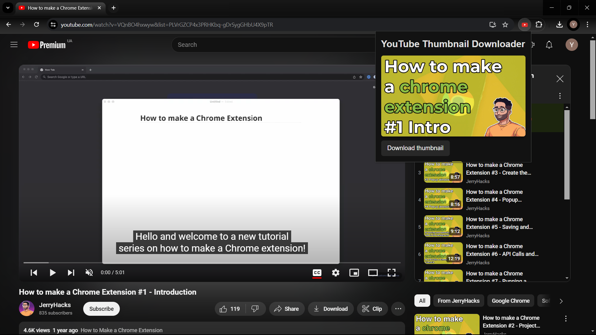
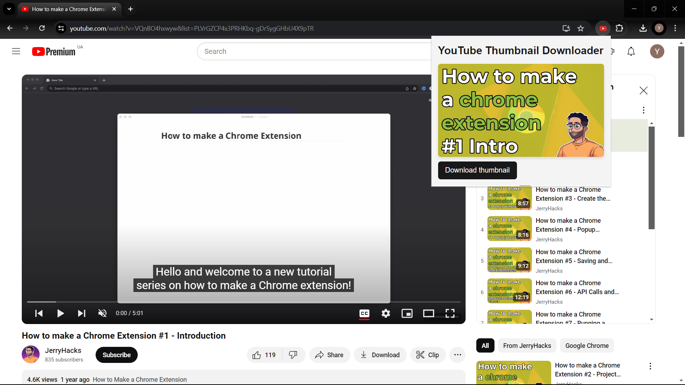

# yt-thumbnail-downloader-ext

A Chrome Extension that allows you to download the thumbnail of a specific YouTube video with ease.

## Usage





1. Navigate to a YouTube video page.
2. Click the "Download thumbnail" button.
3. The thumbnail will be downloaded to your device.

## Built With

- [create-chrome-ext](https://github.com/guocaoyi/create-chrome-ext)
- [React](https://react.dev/)
- [TypeScript](https://www.typescriptlang.org/)

## Installation

1. Ensure you have `Node.js` version >= **14** installed.
2. Clone the repository:
   ```bash
   git clone https://github.com/yuriybahur1/yt-thumbnail-downloader-ext.git
   ```
3. Install the dependencies:
   ```bash
   npm install
   ```

## Development

To start the development server:

```bash
npm run dev
```

### Chrome Extension Developer Mode

1. Open Chrome and navigate to `chrome://extensions`.
2. Enable 'Developer mode' (toggle switch in the top right).
3. Click 'Load unpacked' and select the `yt-thumbnail-downloader-ext/build` folder.

### Normal Frontend Developer Mode

1. Access `http://0.0.0.0:3000/`.
2. To debug the popup page, open `http://0.0.0.0:3000/popup.html`.

## Production

To build the extension for production:

```bash
npm run build
```

The contents of the `build` folder will be the production-ready extension.

## License

This project is licensed under the [MIT License](./LICENSE).
